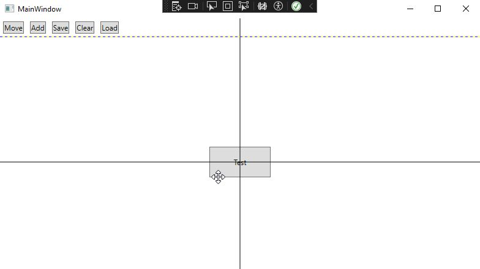

# DraggableHMIControlsLib &middot; 

## Description 

This is a simple WIP library of draggable WPF controls for use in HMI applications.

Included are guide lines and grid-like snapping with customizable spacings for moving controls around.

**
This library is in a very early WIP state and right now more a proof of concept than anything else.
**

No, I didn't want to use extensions for the existing controls.

## Notes
Not included are helper classes 'ObservableObject' and 'RelayCommand' for the ViewModels. Those can be easily replaced with classes from other MVVM packages.

## Screenshot

## License
DraggableHMIControlsLib is [MIT licensed](./LICENSE.txt).